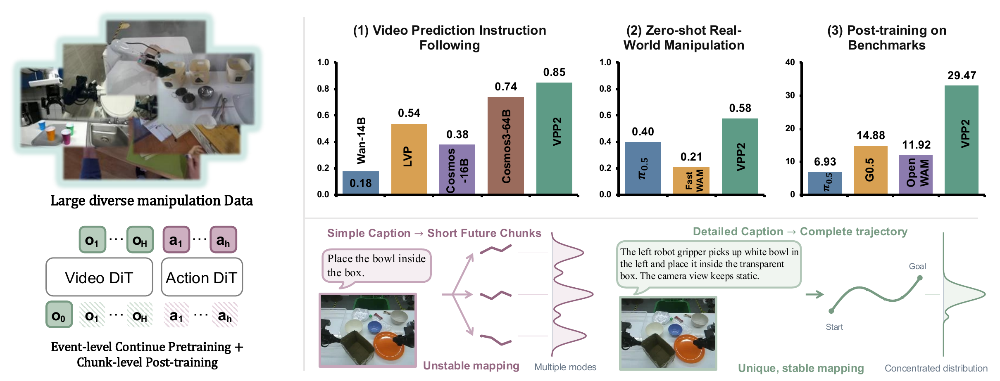

<div align="center">

# Video Prediction Policy 2: Predict Better, Act Better

Official implementation of **["Video Prediction Policy 2: Predict Better, Act Better"](https://arxiv.org/abs/2610.10270)**.

[](https://arxiv.org/abs/2610.10270)
[](https://robert-gyj.github.io/video-prediction-policy-2/)
[](https://modelscope.cn/models/haodong123/VPP2_preview)
[](https://huggingface.co/Haodong082399/VPP2)

</div>

## News

- **[2026-10-08]** 🥇 **VPP2 ranks #1 overall on the official [RoboDojo-Sim leaderboard](https://robodojo-benchmark.com/leaderboard)**, achieving state-of-the-art performance across agent and non-agent tracks with **39.26 Score** and **32.26% SR**.

## What is VPP2?

VPP2 couples a pretrained video model with an action expert to learn robot control
from visual observations, language instructions, and robot state. This repository
provides training, inference, and evaluation code for **RoboDojo** and **LIBERO**,
including **LIBERO-OOD** and **LIBERO-PRO**.

- **Video and action modeling.** Build robot policies on top of a pretrained Wan2.1 video backbone.
- **Training and deployment.** Prepare data, train policies, export checkpoints, and run closed-loop evaluation.
- **Benchmark-specific recipes.** RoboDojo and LIBERO use their own configurations, model settings, and data processing.

<p align="center">
  <a href="assets/teaser.png"></a>
</p>

## Installation

```bash
git clone https://github.com/roboterax/video-prediction-policy-2.git
cd video-prediction-policy-2
conda create -n vpp2 python=3.10 -y
conda activate vpp2
```

Install the CUDA/PyTorch dependencies using the [installation guide](docs/robodojo.md#policy-environment), then install the dependencies from the repository root:

```bash
python -m pip install -r requirements-train.txt -c environment-reference.txt
```

The scripts load VPP2 directly from this checkout; installing the `vpp2` package
is unnecessary. For inference and data processing only, use `requirements.txt`.

## Get started

| Benchmark | What is included | Guide |
|---|---|---|
| RoboDojo | Joint video–action training, checkpoint export, policy serving, and closed-loop evaluation | [RoboDojo guide](docs/robodojo.md) |
| LIBERO | Video-stage training, action training, and standard benchmark evaluation | [LIBERO guide](docs/libero.md) |
| LIBERO-OOD / PRO | Generalization evaluation with the LIBERO policy checkpoint | [OOD and PRO setup](docs/libero.md#6-prepare-three-isolated-simulator-runtimes) |

RoboDojo configurations live in [`configs/robodojo/`](configs/robodojo/); LIBERO
configurations live in [`configs/libero/`](configs/libero/). Follow the guide for
the benchmark you want to use.

## Model Weights

Weights are available on [Hugging Face](https://huggingface.co/Haodong082399/VPP2) and
[ModelScope](https://modelscope.cn/models/haodong123/VPP2_preview).
The Hugging Face repository is public; ModelScope requires an account with access.

| Checkpoint | Use | Hugging Face | ModelScope |
|---|---|---|---|
| RoboDojo history-conditioned Video-10k | Starting Video model for joint + Action2B training | [Download](https://huggingface.co/Haodong082399/VPP2/resolve/main/checkpoints/initialization/robodojo_his10k.pt?download=true) | [ModelScope](https://www.modelscope.cn/api/v1/models/haodong123/VPP2_preview/repo?Revision=master&FilePath=checkpoints/initialization/robodojo_his10k.pt) |
| RoboDojo joint Video-100k | Video model paired with Action2B-100k for evaluation | [Download](https://huggingface.co/Haodong082399/VPP2/resolve/main/checkpoints/joint2b_s100000/video.pt?download=true) | [ModelScope](https://www.modelscope.cn/api/v1/models/haodong123/VPP2_preview/repo?Revision=master&FilePath=checkpoints/joint2b_s100000/video.pt) |
| RoboDojo Action2B-100k | RoboDojo policy evaluation | [Download](https://huggingface.co/Haodong082399/VPP2/resolve/main/checkpoints/joint2b_s100000/action.pt?download=true) | [ModelScope](https://www.modelscope.cn/api/v1/models/haodong123/VPP2_preview/repo?Revision=master&FilePath=checkpoints/joint2b_s100000/action.pt) |
| LIBERO Video-10k | Video model for Action training and evaluation | [Download](https://huggingface.co/Haodong082399/VPP2/resolve/main/checkpoints/libero/video_step010000.pt?download=true) | [ModelScope](https://www.modelscope.cn/api/v1/models/haodong123/VPP2_preview/repo?Revision=master&FilePath=checkpoints/libero/video_step010000.pt) |
| LIBERO Action-30k | LIBERO, LIBERO-OOD and LIBERO-PRO evaluation | [Download](https://huggingface.co/Haodong082399/VPP2/resolve/main/checkpoints/libero/action_step030000.pt?download=true) | [ModelScope](https://www.modelscope.cn/api/v1/models/haodong123/VPP2_preview/repo?Revision=master&FilePath=checkpoints/libero/action_step030000.pt) |

Evaluation uses the matching Video and Action checkpoints together. Shared Wan2.1
VAE, CLIP, UMT5 and tokenizer assets are also available in the model repositories
under `checkpoints/Wan2.1-I2V-14B-480P/`. Follow the benchmark guides to download the
complete assets and normalization files:

- [RoboDojo downloads and evaluation](docs/robodojo.md#checkpoint-downloads)
- [LIBERO / OOD / PRO downloads and evaluation](docs/libero.md#3-data-and-required-model-files)

## TODO

- [ ] Release the robot-video pretrained backbone checkpoint.
- [ ] Release large-scale, event-level video pretraining code and configurations.

## Links

| Resource | Link |
|---|---|
| Paper | [arXiv:2610.10270](https://arxiv.org/abs/2610.10270) |
| Project page | [VPP2 Project Page](https://robert-gyj.github.io/video-prediction-policy-2/) |
| XPolicyLab adapter | [VPP2 RoboDojo adapter PR](https://github.com/XPolicyLab/XPolicyLab/pull/150) |
| ModelScope | [haodong123/VPP2_preview](https://modelscope.cn/models/haodong123/VPP2_preview) |
| Hugging Face | [Haodong082399/VPP2](https://huggingface.co/Haodong082399/VPP2) |

## Documentation

- [RoboDojo: training and testing](docs/robodojo.md)
- [LIBERO, LIBERO-OOD and LIBERO-PRO](docs/libero.md)

## Citation

If you use VPP2 in your research, please cite our [paper](https://arxiv.org/abs/2610.10270)
([BibTeX](CITATION.bib)):

```bibtex
@misc{guo2026videopredictionpolicy2,
  title = {Video Prediction Policy 2: Predict Better, Act Better},
  author = {Yanjiang Guo and Haodong Yan and Zhide Zhong and Zhongru Zhang and
            Qingyuan Yang and Qingzhou Lu and Xiaoyu Chen and Yen-Jen Wang and
            Shuying Deng and Chenghan Yang and Puzhen Yuan and Chenxin Liu and
            Tun Ban and Xiang Zhu and Yichen Liu and Kun Feng and Haoang Li and
            Jianyu Chen},
  year = {2026},
  eprint = {2610.10270},
  archivePrefix = {arXiv},
  primaryClass = {cs.CV},
  url = {https://arxiv.org/abs/2610.10270}
}
```

## License

The code is released under the [MIT License](LICENSE). Third-party components
retain their original licenses; see [third-party notices](THIRD_PARTY_NOTICES.md).
Model weights, datasets, and simulator assets have their own terms.
