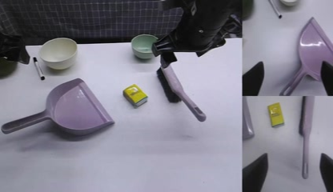
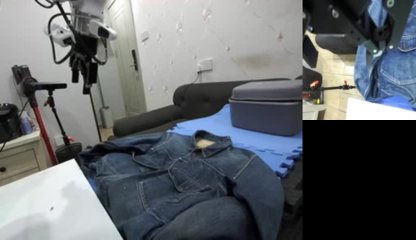

# Zero-shot video prediction

Use [`scripts/infer_video.sh`](../scripts/infer_video.sh) to predict a video from
one RGB condition image and one instruction, or process multiple image–instruction
pairs from a text file. The script loads the Video model and shared encoders, uses
bidirectional video attention and CFG, and saves MP4 files. It uses single-frame
conditioning independently of the benchmark policy/history pipelines.

Start with the prepared examples in [`assets/random_samples/`](../assets/random_samples/)
using the quick start below. For your own inputs, the later sections explain image
composition and prompt enhancement with an agent or Qwen. The inference script
reads the finished images and instructions directly.

## Requirements

Follow the repository [installation instructions](../README.md#installation),
using `requirements.txt` for inference. Provide a compatible Wan2.1 I2V backbone
checkpoint and a Wan model directory containing the shared VAE, CLIP, UMT5, and
tokenizer assets. Run the commands below from the repository root. Use
`PYTHON_BIN=/path/to/python` before the launcher command to select an environment.

## Quick start: run a supplied example

The supplied images and instructions are ready for inference. Start with the first
Aloha example below; replace the checkpoint and Wan model directory with your local
paths. No image preparation or Qwen run is needed for these examples.

Choose a [released video checkpoint](../README.md#model-weights) and match its
prediction horizon: use `--num-frames 49` for `vpp2-video-stage1-49f.pth` or
`--num-frames 17` for `vpp2-video-stage2-17f.pth`. Both use regular denoising
with `--sampling-steps 30 --guidance-scale 4 --sigma-shift 3`. The examples below
use the 49-frame checkpoint.

```bash
bash scripts/infer_video.sh \
  --checkpoint /path/to/vpp2-video-stage1-49f.pth \
  --wan-model-dir /path/to/Wan2.1-I2V-14B-480P \
  --prompt-file assets/random_samples/text_aloha.txt \
  --limit 1 \
  --height 240 --width 416 \
  --num-frames 49 --sampling-steps 30 --guidance-scale 4 --sigma-shift 3 \
  --fps 6 --seed 3402 --caption-prompt \
  --output-dir runs/video_prediction_quickstart
```

Open `runs/video_prediction_quickstart/000001.mp4` to view the prediction with its
instruction underneath. The version without the instruction is saved under `raw/`.
Add `--dry-run` to check inputs and checkpoint shapes without generating a video.

To try another collection, change `--prompt-file` using the table below. Remove
`--limit 1` to run all 20 examples in a collection. Choose a new `--output-dir`
for each run.

| Collection | `--prompt-file` |
| --- | --- |
| Aloha | `assets/random_samples/text_aloha.txt` |
| Panda | `assets/random_samples/text_panda.txt` |
| Human hand | `assets/random_samples/text_hand.txt` |

## Files and instructions

Example inputs are under [`assets/random_samples/`](../assets/random_samples/):

```text
assets/random_samples/
  text_aloha.txt           # 20 Aloha instructions
  text_panda.txt           # 20 Panda instructions
  text_hand.txt            # 20 human instructions
  aloha/
    aloha_0.png ... aloha_19.png
  panda/
    panda_0.png ... panda_19.png
  human_hand/
    hand_0.png ... hand_19.png
```

The supplied images are already prepared at **416 pixels wide by 240 pixels
high**. Pass them directly to inference.

Each UTF-8 text file uses one instruction per line, followed by `@@` and the image
path. Paths are relative to that text file. The three manifests use paths such as
`aloha/aloha_0.png`, `panda/panda_0.png`, and `human_hand/hand_0.png`, respectively.
Keep each instruction on a single line. The supplied instructions are taken from
their source manifests. Inference uses the saved text verbatim.

## Compose robot views

All pixel dimensions below are **width x height**. Use one main view and at most
two wrist views from the same moment.

| View | Processing | Position on the canvas |
| --- | --- | --- |
| `view_0` | Center-crop to height:width = 3:4, then resize to 320x240 | Left, starting at (0, 0) |
| `view_1` | Resize the complete view to 120x120 | Upper right, starting at (320, 0) |
| `view_2` | Resize the complete view to 120x120 | Lower right, starting at (320, 120) |

Start with a black **440x240** canvas. Missing wrist views remain pure black:
with one camera both right panels are black; with two cameras only the lower-right
panel is black. After placing the views, resize the entire canvas to **416x240**
using bicubic interpolation and save as an RGB PNG. Only the main view is cropped;
the wrist views retain their full field of view.

An Aloha input and a Panda input with a missing lower-right view:




The existing image utility implements these steps. From the repository root:

```bash
PYTHONPATH=src python - <<'PY'
from pathlib import Path
from vpp2.utils.conditioning import load_views, prepare_image

# A directory with view_0.png and optional view_1.png / view_2.png,
# or a single main-view image. These are the original, separate views.
source = Path('/path/to/views')
output = Path('/path/to/composed.png')
views, _ = load_views(source)
image, _ = prepare_image(views, 'robot')
output.parent.mkdir(parents=True, exist_ok=True)
image.save(output)
PY
```

For a human ego-view image, center-crop to width:height = 16:9 and resize to
416x240, without wrist panels. Use `prepare_image(views, 'human')` for this case.
Already composed images go directly to inference, without another preparation pass.

The `human_hand/` collection is selected from `0727_human/text2.txt`: the first 10
non-`lvp` image filenames in natural order, followed by 10 randomly selected unique
images whose names start with `lvp`. These are named `hand_0.png` through
`hand_19.png` in that order. Its separate `text_hand.txt` copies one instruction
verbatim from the same source manifest for each image. When an image has multiple
entries, it uses the first entry for ordinary images and the last entry for LVP
images. Robot instructions are kept in `text_aloha.txt` and `text_panda.txt`.

## Write the prompt with an agent or Qwen

> [!IMPORTANT]
> **Prompt enhancement is critical and can significantly affect model performance.**
> Ground the instruction in the input image and describe how the requested task is
> completed. For a two-arm task, describe the **left arm first**, then the **right
> arm**, joining their action clauses with a comma. **End with the camera/view
> description.** Write "keeps static" for an arm that does not need to move.

Give a vision-capable agent or Qwen both the composed image and the task
instruction. Preserve the tool, target, destination, and final state: for example,
"sweep the block into the container using the brush" must retain the brush and
sweeping motion. Review the result against the image before saving it.

This template can be used with either an agent or a Qwen vision-language model:

```text
Given the initial image and the task instruction below, write one detailed English
instruction describing the action to perform and its completed result.

Use only visible objects and the requested task. Preserve the tool, manipulation
method, target, destination, and final state. Do not add unrelated actions or camera
motion. Choose the hand or robot arm best positioned to perform the task; respect
any hand explicitly specified by the instruction.

For two visible hands/arms, describe the left side of the MAIN view first, then the
right side. Join the two action clauses with ", while" instead of a full stop.
Write "keeps static" for a hand/arm that does not need to move. The wrist panels
show additional views of the same scene, not extra arms. If only one arm exists,
describe that arm without inventing a second arm or actions in black panels.

For a robot input, end with:
This is a composed robot video with two wrist-view in the right side.

For a human input, start with "A person uses their left/right hand to ...",
choosing the appropriate hand, and end with:
This is an ego-view video, and the camera remains static.

Return only the final instruction on a single line.
Task instruction: <insert the task here>
```

Example entry in `text_aloha.txt`:

```text
The left robot gripper holds the plastic container by its handle, while the right robot gripper grasps the brush and sweeps the yellow object into the container. This is a composed robot video with two wrist-view in the right side.@@aloha/aloha_3.png
```

Save agent/Qwen-written instructions in a separate file such as
`text_aloha_prompt_enhanced.txt`, alongside `text_aloha.txt`, with the same image paths. This
allows comparison with the original instructions using identical images. A local
Qwen run is optional; inference only requires the finished image and text files.

## Run prediction with your own inputs

Prepare your image and enhance its instruction using the sections above, then
choose one of the input modes below.

### Single image and instruction

Pass one prepared image with `--image` and its instruction with `--prompt`:

```bash
bash scripts/infer_video.sh \
  --checkpoint /path/to/vpp2-video-stage1-49f.pth \
  --wan-model-dir /path/to/Wan2.1-I2V-14B-480P \
  --image /path/to/condition.png \
  --prompt 'A person uses their left hand to pick up the cup and place it into the sink. This is an ego-view video, and the camera remains static.' \
  --height 240 --width 416 \
  --num-frames 49 --sampling-steps 30 --guidance-scale 4 --sigma-shift 3 \
  --fps 6 --seed 3402 --caption-prompt \
  --output-dir runs/video_prediction_single
```

### Batch from a text file

Use `--prompt-file` for a manifest containing one `instruction@@image_path` per
line. Use the quick-start command with `--prompt-file /path/to/prompts.txt`, remove
`--limit 1` to process the full file, and choose a new output directory. This input
mode replaces both `--image` and `--prompt`.

Both input modes use the same prediction settings and accept prepared image files.
Relative paths in a manifest resolve against that manifest's directory. Prompts
are used verbatim. A video file can also supply the condition image through
`--image` or a manifest entry; `--frame-index` selects one frame (default 24).

### Outputs

Choose a new output directory for each run. Videos are named by the manifest's
physical line number (`000001.mp4`, etc.); `run.json` records the corresponding
input, instruction, and seed. A single-image run produces `000001.mp4`.
`--caption-prompt` displays the instruction below the video and retains the
original prediction under `raw/`. Without that flag, the output contains only the
predicted frames.
